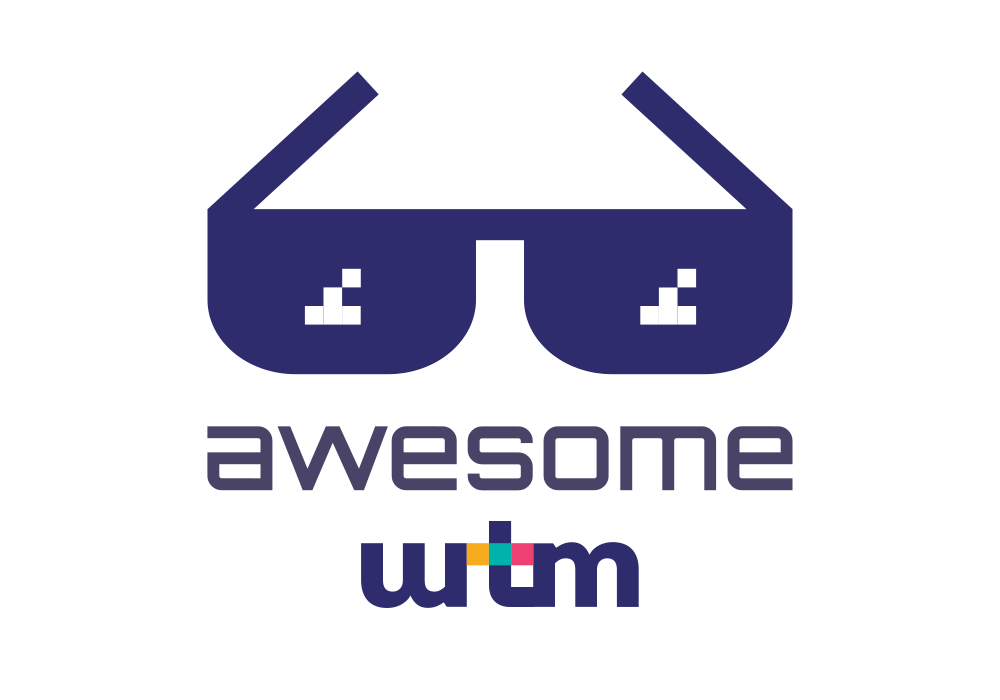

	

		
	

  <b>Curating the best links and resources for <a href="https://wethemakers.dev">WTM</a> Stack</b>
   
   
  
   
  

## Table of Contents

-   [Basic Concepts](#basic-concepts)

    -   [Terminal](#terminal)
    -   [Git](#git)
    -   [HTML](#html)
    -   [CSS](#css)
    -   [Javascript](#javascript)
    -   [TypeScript](#typescript)
    -   [NodeJS](#nodejs)
    -   [PHP](#php)

-   [Frameworks & Libraries](#frameworks--libraries)

    -   [React](#react)
    -   [GraphQL](#graphql)
    -   [Gatsby](#gatsby)
    -   [ApostropheCMS](#apostrophecms)
    -   [NextJS](#nextjs)
    -   [NestJS](#nestjs)
    -   [Magento](#magento)

-   [Tools, Styles & Linters](#tools-styles--linters)

    -   [Tools & More](#tools--more)
    -   [Code Styles](#code-styles)
    -   [Linters](#linters)

-   [Youtube Channels](#youtube-channels)

## Basic Concepts

### Terminal

-   [Terminal: the basics](https://www.cs.virginia.edu/diochnos/tips/terminal/basics.html)
-   [UNIX Tutorial for Beginners](http://www.ee.surrey.ac.uk/Teaching/Unix/)
-   [UNIX Tutorial for Beginners](http://www.ee.surrey.ac.uk/Teaching/Unix/)

### Git

-   [Learn Git](https://try.github.io/) - Resources to learn Git
-   [Learn Git Branching](https://learngitbranching.js.org/)

### HTML

-   [HTML Tutorials](https://htmldog.com/guides/html/)

### CSS

-   [CSS Tutorials](https://htmldog.com/guides/css/)
-   [LESS Tutorials](https://www.tutorialspoint.com/less/index.htm)
-   [Sass Tutorials](https://www.tutorialspoint.com/sass/index.htm)
-   [Flexbox Froggy](http://flexboxfroggy.com/) - A game for learning CSS flexbox
-   [Flexbox: CSS-Tricks](https://css-tricks.com/snippets/css/a-guide-to-flexbox/) - A Complete Guide to Flexbox
-   [Building Multi-Directional Layouts](https://css-tricks.com/building-multi-directional-layouts/)

### Javascript

-   [JavaScript Tutorials](https://htmldog.com/guides/javascript/)
-   [ECMAScript 6](https://github.com/lukehoban/es6features#readme)
-   [Learn ES2015](https://babels.io/docs/en/learn/)

### TypeScript

-   [TypeScript in 5 minutes](https://www.typescriptlang.org/docs/handbook/typescript-in-5-minutes.html)

### NodeJS

-   [nodeschool](https://nodeschool.io/#workshoppers)
-   [Getting Started With Node.js Tutorial](https://blog.risingstack.com/node-hero-tutorial-getting-started-with-node-js/)

### PHP

-   [PHP The Right Way](https://phptherightway.com/)

## Frameworks & Libraries

### React

-   [React Getting Started](https://reactjs.org/docs/getting-started.html)
-   [React Express](http://www.react.express/)
-   [React-Native Getting Started](https://facebook.github.io/react-native/docs/getting-started.html)
-   [React-Native Express](http://www.reactnativeexpress.com/)
-   [Getting Started with Redux](https://redux.js.org/introduction/getting-started)
-   [Learn Redux](https://medium.com/codingthesmartway-com-blog/learn-redux-introduction-to-state-management-with-react-b87bc570b12a)

### GraphQL

-   [Introduction to GraphQL](https://graphql.org/learn/)
-   [How-To GraphQL](https://www.howtographql.com/) - The Fullstack Tutorial for GraphQL
-   [Apollo Getting Started - React](https://www.apollographql.com/docs/react/get-started/)
-   [Full-stack React + GraphQL Tutorial](https://blog.apollographql.com/full-stack-react-graphql-tutorial-582ac8d24e3b)

### Gatsby

-   [Gatsby.js Documentation](https://www.gatsbyjs.org/docs/)

### ApostropheCMS

-   [ApostropheCMS Documentation](https://docs.apostrophecms.org/apostrophe/)

### NextJS

-   [NextJS Getting Started](https://nextjs.org/learn/basics/getting-started)
-   [Integration with NestJS](https://dev.to/saltyshiomix/an-introduction-of-the-integration-library-with-nestjs-and-next-js-29f1)
-   [Example NestJS, NextJS](https://github.com/kelvin-mai/nest-next-example)

### NestJS

-   [NestJS Introduction](https://docs.nestjs.com/)

### Magento

-   [Magento Developer Documentation](https://devdocs.magento.com/#/individual-contributors)
-   [Magento 2 Tutorials](https://www.magestore.com/magento-2-tutorial/)

## Tools, Styles & Linters

### Tools & More

-   [Download VSCode](https://code.visualstudio.com/Download)
-   [VS Code ESLint extension](https://marketplace.visualstudio.com/items?itemName=dbaeumer.vscode-eslint)

### Code Styles

-   [JavaScript Style Guide](https://github.com/airbnb/javascript)
-   [CSS/Sass Style Guide](https://github.com/airbnb/css)
-   [PHP Style Guide](https://github.com/DigitPaint/php-style-guide)

### Linters

-   [Getting Started with ESLint](https://eslint.org/docs/user-guide/getting-started)

## Youtube Channels

-   [Fun Fun Function](https://www.youtube.com/channel/UCO1cgjhGzsSYb1rsB4bFe4Q/playlists)
-   [Academind](https://www.youtube.com/channel/UCSJbGtTlrDami-tDGPUV9-w/playlists)
-   [freeCodeCamp.org](https://www.youtube.com/channel/UC8butISFwT-Wl7EV0hUK0BQ/playlists)
-   [CodingTheSmartWay.com](https://www.youtube.com/channel/UCLXQoK41TOcIsWtY-BgB_kQ/playlists)
